# IoTerminal (팀명: 이김손)

  

---

## 📋 목차
- [👀 서비스 소개](#-서비스-소개)
- [📅 프로젝트 기간](#-프로젝트-기간)
- [⭐ 주요 기능](#-주요-기능)
- [⛏ 기술 스택](#-기술-스택)
- [⚙ 시스템 아키텍처](#-시스템-아키텍처)
- [🖥 화면 구성](#-화면-구성)
- [👨‍👩‍👦‍👦 팀원 소개](#-팀원-소개)
- [🤾‍♂️ 트러블슈팅](#-트러블슈팅)

---

## 👀 서비스 소개

  <b style="color:#9B6B9E">IoT 빅데이터 수집 및 관리 시스템</b> 
  실시간 IoT 센서 데이터 수집, 분석, 관리의 모든 것을 한 곳에서

---

## 📅 프로젝트 기간

  

---

## ⭐ 주요 기능

|    **실시간 센서 데이터 스트리밍** |    **데이터 관리 워크플로우** |    **IoT 디바이스 관리** |
|:---:|:---:|:---:|

---

## ⛏ 기술 스택

| 구분 | 내용 |
|:---:|:---:|
| **사용언어** |      |
| **라이브러리** |       |
| **개발도구** |  |
| **서버환경** |  |
| **데이터베이스** |  |
| **협업도구** |   |

---

## ⚙ 시스템 아키텍처

  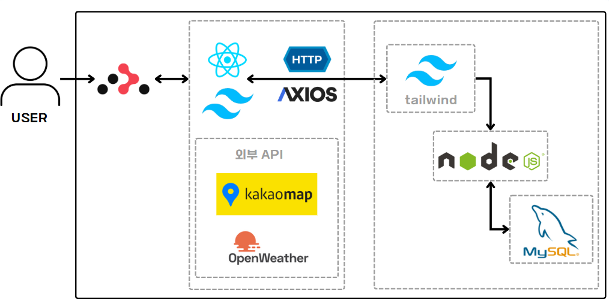

---

## 📌 시스템 설계

| SW 유스케이스 | 서비스 흐름도 |
|:---:|:---:|
| 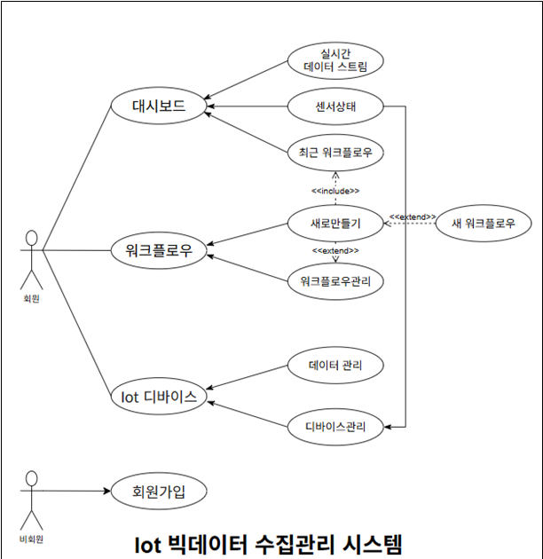 | 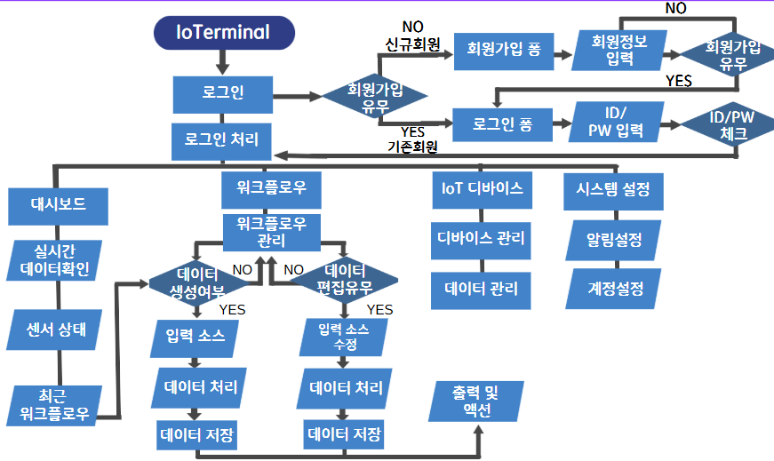 |
| **ER 다이어그램** | |
| 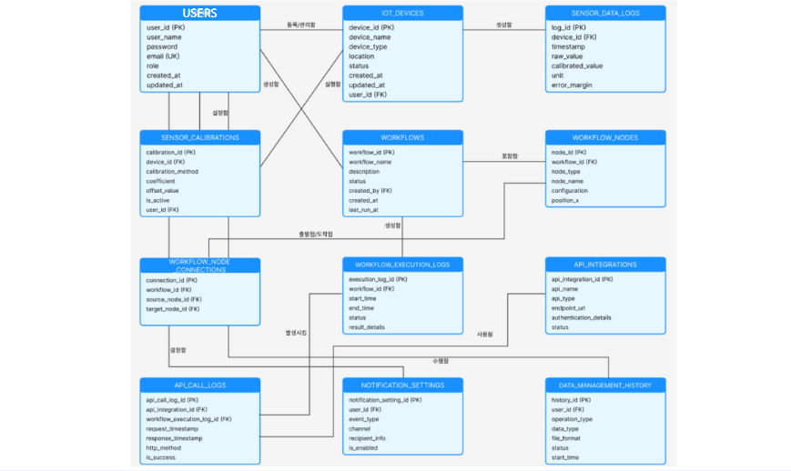 | |

---

## 🖥 화면 구성

| 메인화면 | 대시보드 |
|:---:|:---:|
| 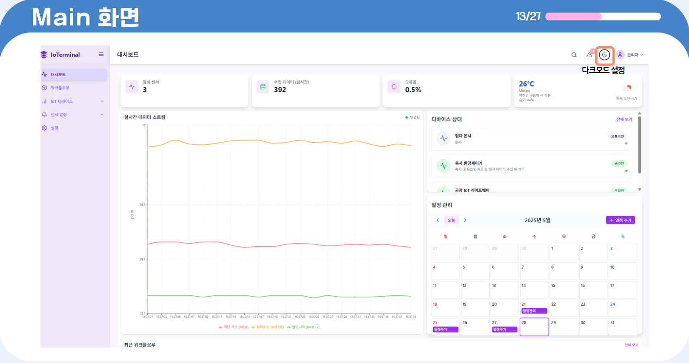 | 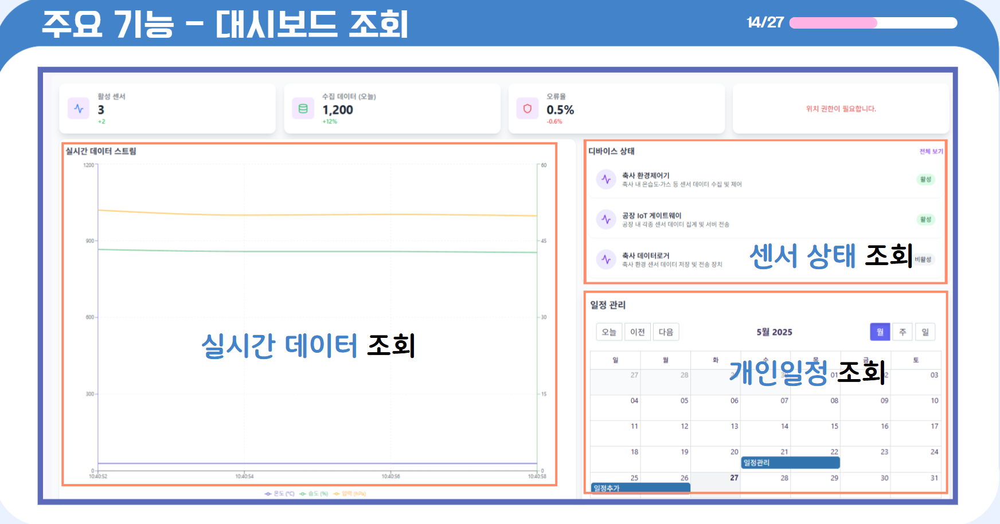 |
| 워크플로우 | 센서 관리 |
| 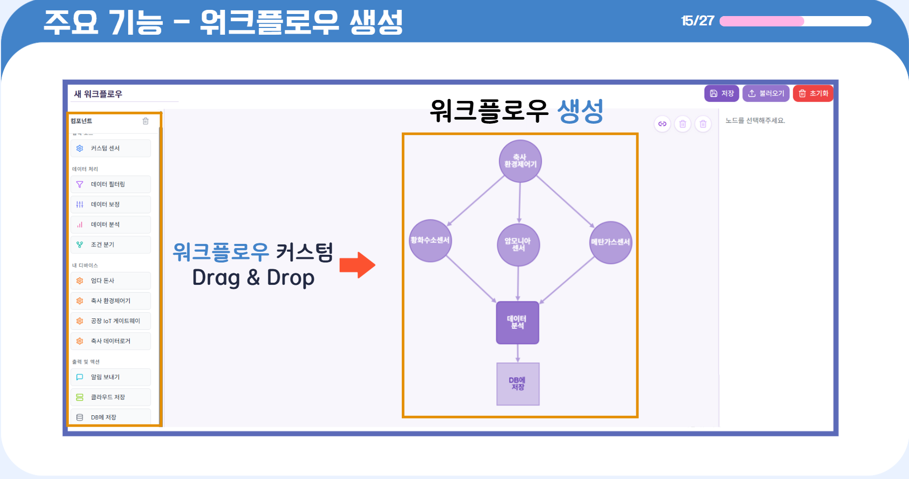 | 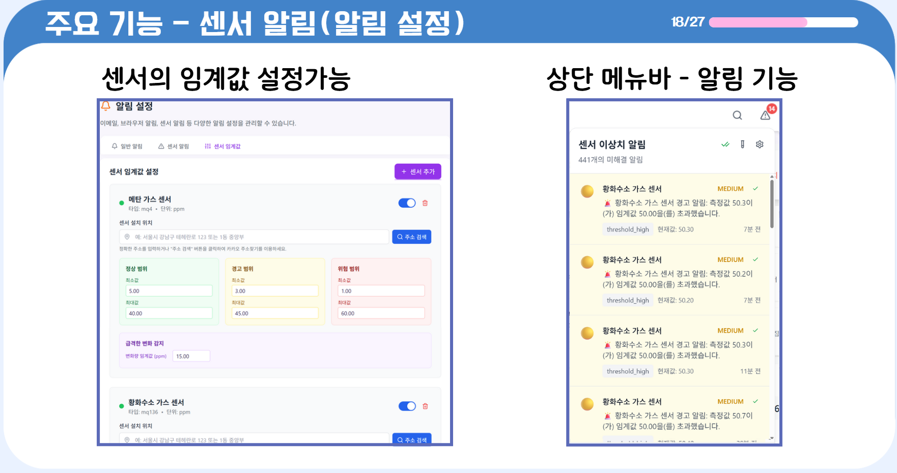 |
| IoT 디바이스 | 디바이스 상세 |
|  | 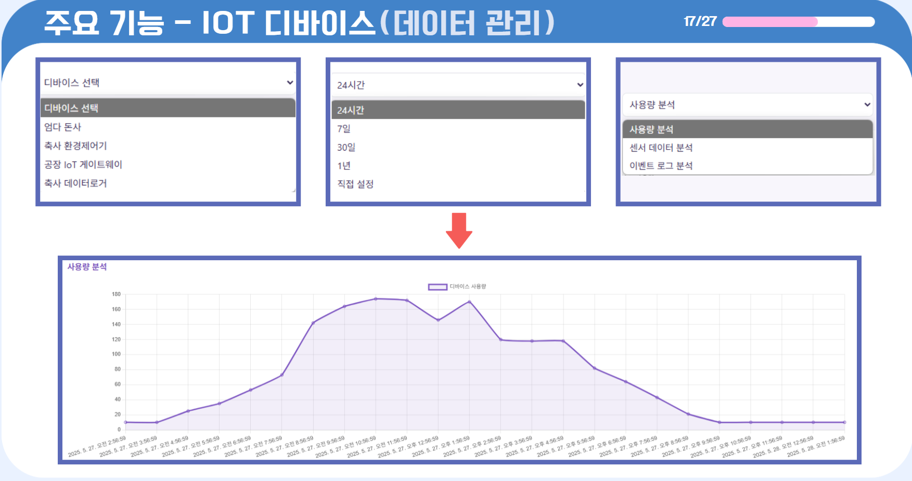 |

---

## 👨‍👩‍👦‍👦 팀원 소개

|    **김유진**   PM/산출문서관리    |    **김양선**   BACK-END(SUB)/ DB 설계 및 연동    |
|:---:|:---:|
|    **이석구**   Backend/Frontend    |    **손지수**   Frontend(sub)/ 영상편집및제작    |

---

## 🤾‍♂️ 트러블슈팅

| 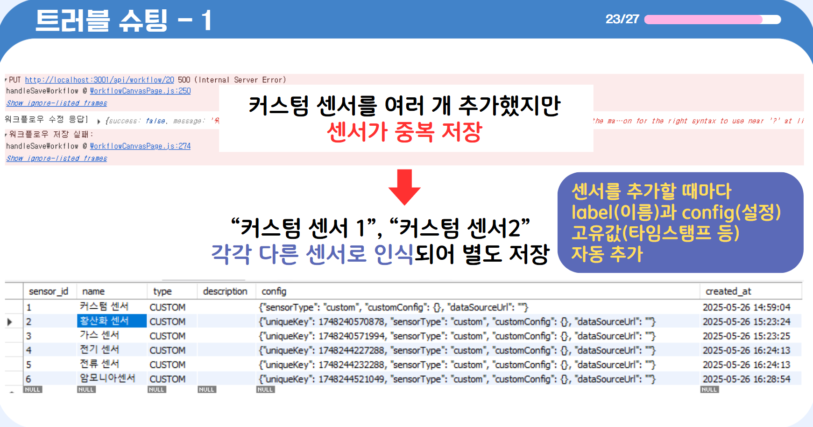 | 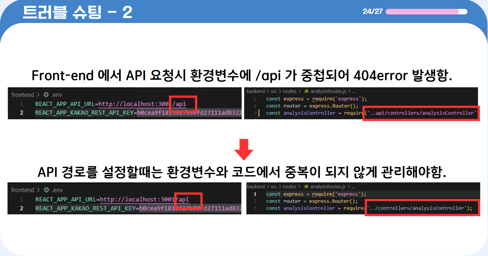 |
|:---:|:---:|

