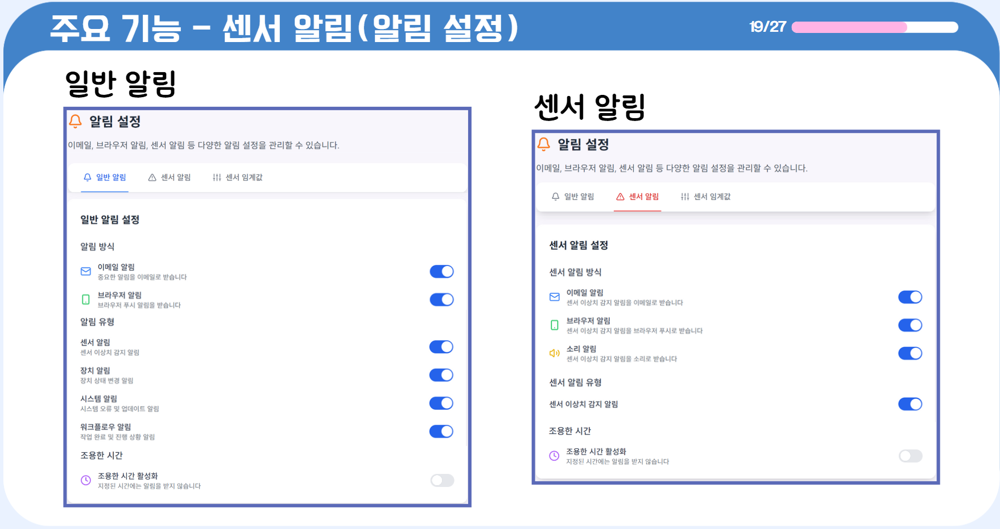

#  IoTerminal(팀명: 이김손)

## 👀 서비스 소개
* 서비스명:  IoTerminal
* 서비스설명: IoT 빅데이터 수집 및 관리 시스템
 

## 📅 프로젝트 기간
2025.04.22 ~ 2025.06.04 (6주)
 

## ⭐ 주요 기능
* IoT센서의 스트림
* 워크플로우 연결을 통한 데이터 관리 
* IoT디바이스 관리 

 

## ⛏ 기술스택
<table>
    <tr>
        <th>구분</th>
        <th>내용</th>
    </tr>
    <tr>
        <td>사용언어</td>
        <td>
            
            
            
            
            
        </td>
    </tr>
    <tr>
        <td>라이브러리</td>
        <td>
            
            
            
            
            
            
        </td>
    </tr>
    <tr>
        <td>개발도구</td>
        <td>
            
        </td>
    </tr>
    <tr>
        <td>서버환경</td>
        <td>
            
        </td>
    </tr>
    <tr>
        <td>데이터베이스</td>
        <td>
            
        </td>
    </tr>
    <tr>
        <td>협업도구</td>
        <td>
            
            
        </td>
    </tr>
</table>

 

## ⚙ 시스템 아키텍처(구조)

 

## 📌 SW유스케이스
 

## 📌 서비스 흐름도

 

## 📌 ER다이어그램

 

## 🖥 화면 구성

### 메인화면

 

### 대시보드

 

### 워크플로우

 

### 센서

 

 

 

### IoT 디바이스

 

 

## 👨‍👩‍👦‍👦 팀원 역할
<table>
  <tr>
    <td align="center"></td>
    <td align="center"></td>
    <td align="center"></td>
    <td align="center"></td>
  </tr>
  <tr>
    <td align="center"><strong>김유진</strong></td>
    <td align="center"><strong>김양선</strong></td>
    <td align="center"><strong>이석구</strong></td>
    <td align="center"><strong>손지수</strong></td>
  </tr>
  <tr>
    <td align="center"><b>PM/산출문관리</b></td>
    <td align="center"><b>BACK-END(SUB)/ DB 설계 및 연동</b></td>
    <td align="center"><b>Backend/ Frontend</b></td>
    <td align="center"><b>Frontend(sub)/ 영상편집및제작</b></td>
  </tr>
  <tr>
    <td align="center"><a href="https://github.com/자신의username작성해주세요" target='_blank'>github</a></td>
    <td align="center"><a href="https://github.com/자신의username작성해주세요" target='_blank'>github</a></td>
    <td align="center"><a href="https://github.com/자신의username작성해주세요" target='_blank'>github</a></td>
    <td align="center"><a href="https://github.com/자신의username작성해주세요" target='_blank'>github</a></td>
  </tr>
</table>

## 🤾‍♂️ 트러블슈팅
  
* 문제1 
 
 
 
* 문제2 
 
 
